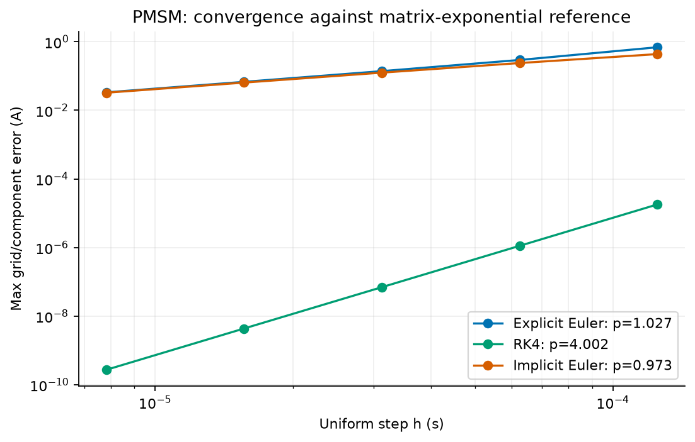
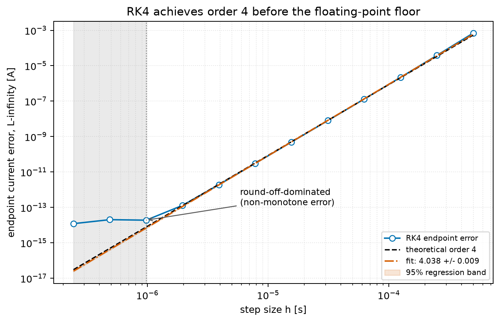

# Week 3 · 先读 Tutorial 3，再决定 GitHub 内容

## Tutorial 3 的实际要求

已完整阅读 `04_Tutorials/tutorial3_slides.pdf` 的 12 页。第三周主题是 **Scientific visualization, first-wave review**，工作顺序是：

1. 从 Seminar 1、教师评语或自己的 issue 中选择一条具体观察；
2. 把观察变成一项可量化结果；
3. 给出 before/after 图；
4. 端到端重跑脚本、保存新图并更新报告相应章节；
5. 团队记录最高严重度 finding 与下一项 fix plan；
6. 每位成员本人完成 Seminar 1 peer-review 表和数据库记录。

教程对挑战图的明确要求是：误差-步长双对数图、理论阶参考线、拟合斜率及标准误、95% band、舍入误差区标注；标题说结论，坐标带单位，曲线可仅靠线型/标记区分，固定文件名保证复现。

课程幻灯片引用了单独的 `visualization guide`，但用户提供的资料目录中没有该文件。本包只采用 Tutorial 3 幻灯片中明确列出的规则，没有假装读取缺失文件。

## 本次选择的具体反馈

**Finding：** 前两周的 `pmsm_convergence.png` 已给出三种方法的拟合阶，但缺少理论斜率线、拟合不确定性和舍入误差区。它能展示结果，尚未完全达到 Tutorial 3 的定量图标准。

选择它作为最高严重度修复的理由：方法阶是报告中“代码实现正确”的核心证据。图上没有说明拟合区间或数值下限，读者无法判断斜率来自渐近区、粗网格区还是浮点平台。

### Before

优点：同一误差指标下比较三种方法，并报告观测阶。缺口：一张图承载三项主张；没有理论斜率、拟合误差、拟合点范围和浮点误差区。

### After

新图只回答一个问题：**RK4 是否在浮点误差占主导前达到四阶？**

- 误差指标：末时刻两电流分量的最大绝对误差，单位 A；参考解是同一模型的矩阵指数解。
- 数据网格：T=0.03 s，N=60 到 122880，h=T/N。
- 拟合范围：N=120 到 7680，即 h=2.5e-4 到 3.90625e-6 s；最粗点因尚未进入稳定的渐近区而排除。
- 实际拟合：斜率 **4.038 ± 0.009**，标准误来自 log(error) 对 log(h) 的线性回归协方差。
- 黑色虚线是理论四阶，不是另一组拟合。
- h≤9.765625e-7 s 的误差开始非单调，标为 round-off-dominated 区；这些点不参与阶数拟合。
- 灰/橙色带是确定性数据的回归拟合诊断。它不代表重复实验的随机 95% 覆盖概率；若是 Monte Carlo 问题，需要跨随机种子重复后用样本间离散度构造 band。

完整数值位于 `results/week3_rk4_convergence.csv`；拟合选择和结论位于 `results/week3_review.json`。`python code/week3_review.py` 可独立重做图与数据，`python code/run_all.py` 可重做第一到第四周全部结果。

## 端到端修复如何落到报告

`report/week3_quantitative_result.md` 提供与新图一致的英文 Methods/Result/Caption 草稿。使用时必须连同项目最终参数一起核查；如果团队换了参数，先重跑脚本，再改报告数字，不能只保留旧文字。

图表选择遵守 Tutorial 3：使用蓝、橙、黑和线型/标记双重编码；不使用 jet；标题是结论；坐标含变量与单位；固定文件名；图注说明“展示什么、为什么重要”。

## 本周 finding 与 fix plan 草稿

| 项目 | 可放入 Weekly Milestone 的草稿 | 状态 |
|---|---|---|
| highest-severity finding | Convergence evidence did not identify the fit range, theoretical slope, or floating-point floor. | 已用脚本修复 |
| completed | Added a reproducible RK4 refinement study with slope 4.038 ± 0.009, a theoretical order-4 line, regression band, and round-off annotation. | 已完成 |
| next fix | Replace teaching parameters with the team's final documented PMSM data, rerun all figures, and update the report numbers. | 待团队确认参数 |
| current blocker | The supplied learning materials do not contain the team's final measured/selected motor parameters or actual Seminar 1 comments. | 真实限制 |

这是可编辑草稿，不代表已经提交到论坛或 Weekly-Milestone DB。

## 第三周没有替本人完成的事项

- 真实 Seminar 1 feedback：未提供，因此没有虚构评语；本次选用教程给出的典型具体问题。
- Individual-Challenge Database、course forum、Weekly-Milestone DB：没有外部提交。
- Peer-review：没有虚构纸质表、分数或评论；每位成员应在 Seminar 1 本人完成。
- Git 历史：压缩包保存文件，不伪造三周内的 commit 时间线。

## 第三周应能解释的问题

1. 为什么阶数拟合必须排除粗网格和舍入平台；
2. 为什么确定性收敛表的 regression band 只是拟合诊断；
3. 为什么末点误差和全轨迹最大误差回答不同问题；
4. 为什么当前新图只针对 RK4，而不是同时证明所有方法；
5. 如果换最终 PMSM 参数，哪些内容必须重新计算：平衡点、Jacobian 谱、稳定边界、参考轨迹、收敛表与图中数字。
