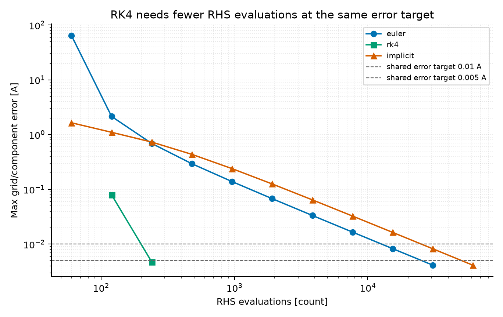

# Week 4 · 实际复现结果

本页由 `python code/run_all.py` 或 `python code/week4_reproduction.py` 生成。参数为教学示例。

## 与报告逐项比对

| 数字 | 报告值（3位有效数字） | 本次值 | 单位 | 状态 |
|---|---:|---:|---|---|
| RK4 fitted endpoint order | 4.04 | 4.04 | dimensionless | PASS |
| Euler stability boundary | 0.286 | 0.286 | ms | PASS |

## 匹配精度的成本比较

| 共同误差上限 (A) | 方法 | N | 实测网格误差 (A) | RHS | Jacobian | Newton 修正 |
|---:|---|---:|---:|---:|---:|---:|
| 0.01 | euler | 15360 | 0.00827688 | 15360 | 0 | 0 |
| 0.005 | euler | 30720 | 0.00413195 | 30720 | 0 | 0 |
| 0.01 | rk4 | 60 | 0.00473035 | 240 | 0 | 0 |
| 0.005 | rk4 | 60 | 0.00473035 | 240 | 0 | 0 |
| 0.01 | implicit | 15360 | 0.00822511 | 30720 | 15360 | 15360 |
| 0.005 | implicit | 30720 | 0.004119 | 61440 | 30720 | 30720 |

图展示什么：三种方法从各自细化网格得到的误差与 RHS 次数。为什么重要：统一误差上限之后才能比较计算成本。这里 RK4 的 RHS 次数最少；统计不含 Jacobian/线性求解成本，不能改写为运行时间排名。

Lyapunov 恒等式数值缺陷：0.000e+00。

Git commit、运行版本、源码哈希和命令见 `results/week4_reproduction.json`。未建立真实提交时，Git 状态会明确显示 PENDING_REAL_COMMIT。
