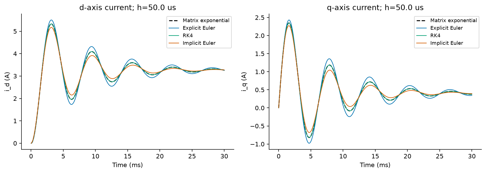
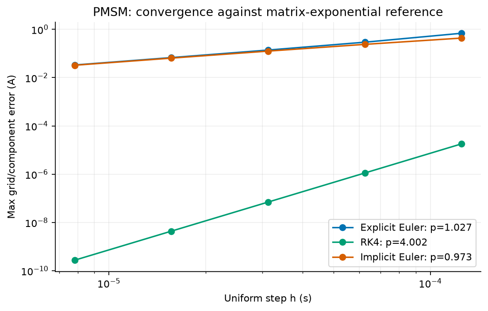
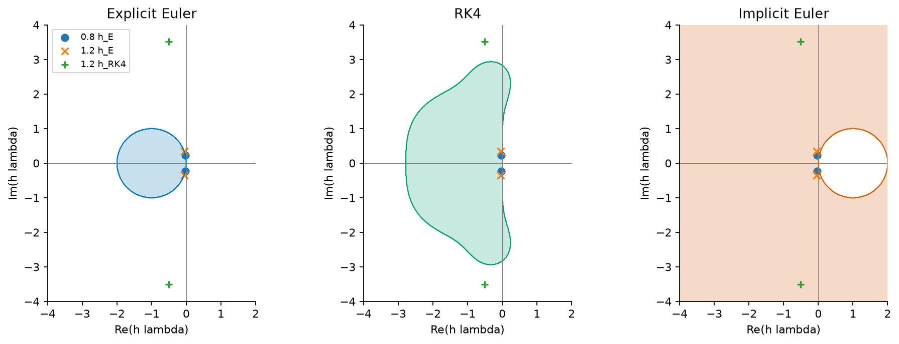
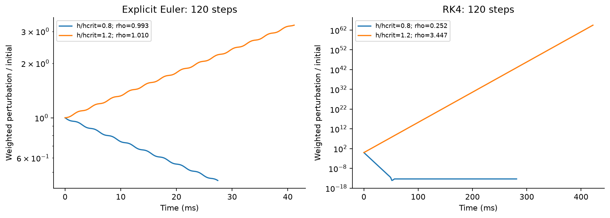
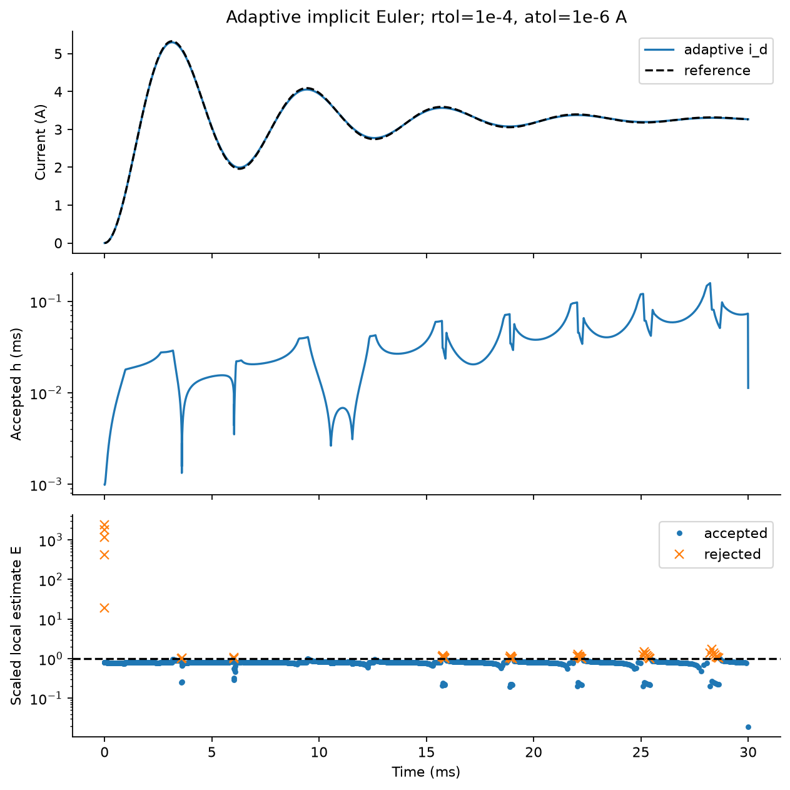
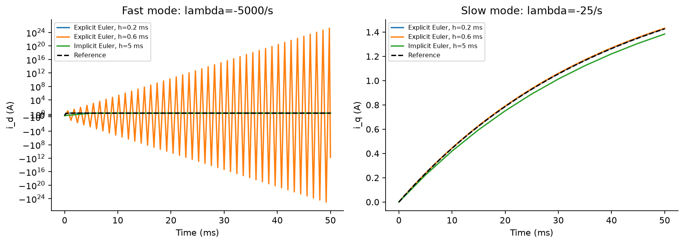
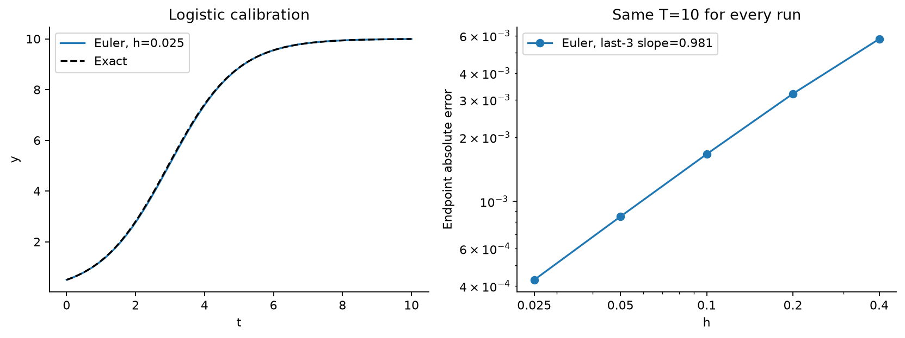
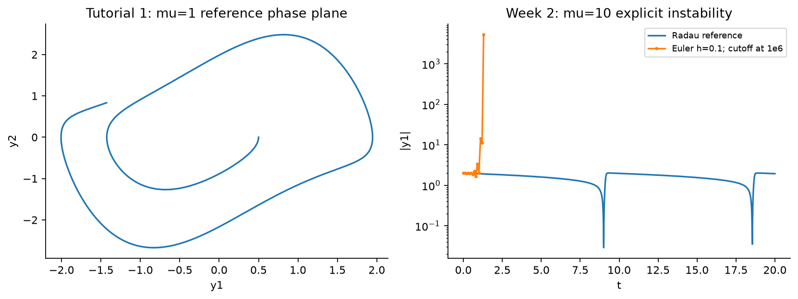
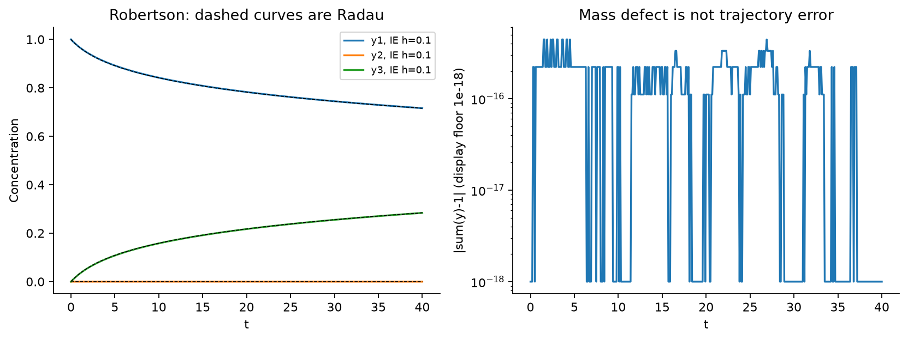
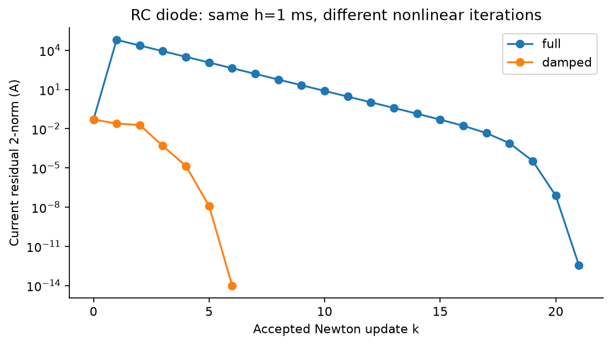

# 前两周实际运行结果

本页由 `python code/run_all.py` 自动生成。参数见 `parameters.json`，是教学示例参数。

## PMSM 基准算例

- 平衡电流 [i_d*, i_q*] = [3.265306122448979, 0.40816326530612246] A。
- 特征值 [实部, 虚部] = [[-145.83333333333331, 999.7829625584855], [-145.83333333333331, -999.7829625584855]]，单位 1/s。
- Euler 稳定性边界：0.285714286 ms；RK4：2.929621898 ms。边界等号不保证衰减。
- 衰减率之比：1；当前基准不具备明显的快慢衰减尺度分离。
- 网格最大误差的最后三点拟合阶：Euler 1.02748；RK4 4.00176；隐式 Euler 0.97319。
- 独立 Radau 与矩阵指数参考解的最大差：4.987e-13 A。
- PMSM 首步 Newton 修正次数：1。这验证线性残差的性质，不能据此声称验证了非线性二次收敛。

两条电流均与矩阵指数解比较；同一步长下可看出一阶方法的相位和阻尼误差。

误差取全部网格点、全部分量的最大绝对误差，避免末时刻接近平衡点而掩盖暂态误差。拟合只取最后三点，完整数据保留在 results。

阴影满足 |R(z)|≤1；同一特征值在不同步长下的位置说明方法允许的步长不同。隐式 Euler 的完整稳定域为圆盘 |1-z|<1 的外部及边界。

每条曲线运行 120 步，时长随步长变化；用途是检验扰动的增长或衰减，不是比较相同末时刻的精度。

## 自适应隐式 Euler

| rtol | 接受/拒绝 | RHS 次数 | h 最小/最大 (ms) | 最大局部 E | 全程网格误差 (A) |
|---|---:|---:|---:|---:|---:|
| 1e-03 | 485/68 | 3318 | 0.0024/0.38275 | 0.9992 | 0.11303 |
| 1e-04 | 1492/40 | 9192 | 0.00098631/0.15837 | 0.9933 | 0.037507 |
| 1e-05 | 4714/6 | 28320 | 0.0003118/0.046665 | 0.9970 | 0.011966 |

每次试算含一次整步和两次半步；RHS 次数包括拒绝步和残差求值，不计 Jacobian、线性分解、参考解或绘图成本。此表展示容差收紧的效果，不是匹配全局精度的效率排名。

接受步的 E≤1，拒绝步保留原时间和原状态后重试。E 是局部误差估计，不能当作全局误差上界。

人为对照参数给出 -5000 与 -25 的两个实特征值，衰减率之比为 200；这与基准的振荡限制不同。隐式大步稳定，但快暂态仍可能不准确。

## 课堂例题复现

- Logistic Euler 最后三点阶：0.98080；正确手算两步 0.595 和 0.7069195 已通过（讲义第二步有算术笔误，见资料核对页）。
- Tutorial 1 Van der Pol：mu=1、y0=(0.5,0)、T=10；参考 y1(T)=-1.4281535683；规定四步长的端点 L2 拟合阶=0.98305。额外细网格保留在 CSV。
- Week 2 Van der Pol：mu=10、y0=(2,0)、h=0.1，在 t=1.300 时触发状态幅值 1e6 的停止阈值；不是参考解发散。
- Robertson：隐式 h=0.1 到 T=40；最大质量缺陷 4.441e-16，末点分量最大误差 3.479e-04。质量守恒与轨迹精度单独衡量。
- RC 二极管首步 h=1 ms：完整 Newton 21 次，阻尼 Newton 6 次；两者到达同一个隐式根。
- 在给定离散扫描网格上，每步至多 10 次 Newton 修正的最大步长：完整 Newton 0.2 ms，阻尼 Newton 20 ms。这不是连续 h 的精确临界值。

解析解校准 Euler；一阶收敛是可重复的数值证据。

左图是第一周指定初值的相图；右图是第二周不同参数的失败例。两者不可混用。

轨迹比较与质量缺陷并列，说明守恒检查不能代替独立参考解。

阻尼减少首步过冲；横轴是 Newton 修正次数，不是物理时间。完整迭代表见 results/lab_rc_step_sweep.csv。

## 验证范围

所有输出由本次代码实际计算；完整设置和软件版本见 results/summary.json。数值验证只覆盖这些算例，不声称证明任意非线性系统的稳定性或任意参数下的正确性。学生本人应复跑并填写自己的理解、修改和真实贡献记录。
